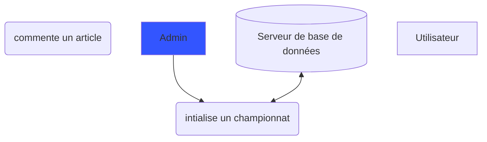

# Documentation Football

La fédération Française de Football souhaite refaire son site internet permettant la visualisation des matchs ainsi que leur gestion depuis un panel administrateur.  
Un script de création d’une base de données et insertion de données a été fourni pour la réalisation. Ce qui a amené à des modifications du schéma conceptuel de base pour qu’il puisse répondre à la demande exprimée.  
La demande attendue est de pouvoir générer automatiquement les matchs pour un championnat en fonction du résultat de la précédente saison. Il faut également pouvoir modifier les scores des matchs tout en affectant le classement de la saison.

### Architecture
L'architecture se base sur un serveur Apache et d'une base de données Postgres.

### Cas d'utilisation

Ce diagramme présente les fonctionnalités disponibles sur l'application

